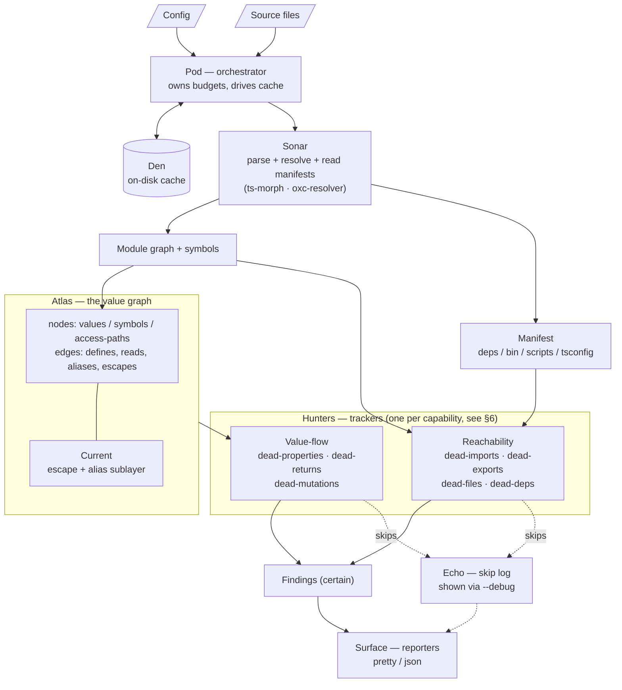

# Orcas — Technical PRD

> The *how*. This document is meant to be **locked** — the architecture is chosen so we can
> deepen capabilities later without re-architecting. Companion: [Product PRD](./product-prd.md).

---

## 0. Locked decisions (the foundation)

| Area | Decision | Rationale |
|------|----------|-----------|
| **Engine language** | **TypeScript first.** A Rust/oxc core is a *later* speed optimization, not v1. | Contributors are JS/TS devs; we reuse TypeScript's own type system; the hard part (the analysis algorithms) costs the same in any language. |
| **Output model** | **Report-only.** Never mutates source. | Trust first. Auto-fix is opt-in, far-future, and out of scope for v1. |
| **Uncertainty model** | **Silent-but-honest.** Default run reports only **100%-certain** findings. `--debug` (or config) turns on a **diagnostics layer** that reports everything skipped + the reason. | A false positive in a dead-code tool is dangerous — people delete on it. Certainty-by-default makes findings trustworthy; `--debug` keeps it transparent. |
| **Interprocedural depth** | **Bounded.** Follow a value into called functions ~1–2 calls deep (configurable), under a hard budget, then bail to "consumed". | Catches the common real cases, stays fast, and satisfies the "safe from endless loops" requirement. |
| **Feature scope (v1)** | **All 9 trackers present** — reachability (imports, exports, files, dependencies) + value-flow (nested keys, returns, mutations) — each with an explicit **v1 certainty boundary** (§6). Trackers 6–9 ship in conservative mode. | The pluggable-tracker design + certainty-by-default means ambitious scope is safe: hard/ambiguous cases simply produce no false alarm. Deepening later is adding logic to an existing tracker, not a rewrite. |
| **Workspace model** | Single-package by default; **auto-detect pnpm/yarn/npm workspaces** and analyze cross-package usage. "Globally" = across the workspace. | Works out of the box for the common case; scales to monorepos without separate tooling. |
| **Scale / run model** | Mid-to-large repos (target: hundreds-of-k LOC); **one-shot scan + on-disk cache**. No watch/editor mode in v1, but architecture leaves a hook for it. | Pragmatic for a CLI tool; caching makes repeat runs fast. |

### Self-resolved engineering calls

| Topic | Decision |
|-------|----------|
| Semantic backbone | **TypeScript Compiler API** (via **`ts-morph`** for ergonomics) for AST + type info, paired with **`oxc-resolver`** for fast module resolution. |
| Supported file types (v1) | `.ts .tsx .js .jsx .mjs .cjs`. Vue/Svelte SFCs → plugin, later. |
| Files & dependencies | Detected at the **module-graph + manifest** level (not the value graph). **Conservative by default**: when usage may flow through unrecognized config/framework conventions, Orcas stays silent instead of flagging (sidesteps the industry's ~40% false-positive norm). Framework plugins = roadmap. |
| "Consumed" safe bail-outs | logging, `JSON.stringify`/serialization, network/disk writes, spread (`{...x}`/`[...x]`), dynamic/computed access, return from a public-API function → all treated as **consumed**. |
| Item-6 noise control | Only flag discarded returns from *pure-looking* functions; never flag known side-effecting calls. |
| Suppression | `// orcas-disable-next-line <rule>` / `// orcas-disable <rule>` comments + config `ignore` globs. |
| Reporters | Pretty CLI + `--json` + CI exit codes. SARIF later. |
| License | MIT. |
| Module name | `orcas` (single published package, internally modular). |
| Testing | Runner = **Vitest** (TS-first, fast, ESM-native, snapshot support). The `test/` tree **mirrors `src/` 1:1**; fixtures are **hermetic & purpose-built** — they reference nothing outside themselves (no real `src/`, no `node_modules`, no shared state, no other fixture). See §12. |
| Self-analysis | Orcas runs on its **own** `src/` in CI as a quality gate — an **internal practice, not a user feature** (no special "self mode"). See §13. |

---

## 1. System overview

Orcas is a pipeline. Files go in; a parsed-and-resolved model is built. Two layers feed the
trackers: **Sonar's module graph + manifest** (which files, symbols, and packages exist and
how they connect) and **Atlas, the value graph** (every produce/consume/alias/escape
relationship). Each **tracker** queries whichever layer it needs — *reachability* trackers
read Sonar, *value-flow* trackers read Atlas — and a reporter prints the results.



---

## 2. Module naming (professional, not verbatim)

`req.md` asks for professional, evocative module names (like Docker / ESLint internals)
rather than literal `find-unused-import`. Orcas uses an **echolocation theme** — fitting,
since orcas hunt by sonar. The placeholder names "tracker" and "graph" from `req.md` are
superseded by **Hunters** and **Atlas**.

| Subsystem | Codename | Responsibility |
|-----------|----------|----------------|
| Orchestrator | **Pod** | Coordinates the run, owns time/depth **budgets**, drives the cache. |
| Parse + resolve | **Sonar** | AST parsing, module resolution, symbol identity. |
| Value graph | **Atlas** | The map of every value and its produce/consume/alias/escape edges. |
| Escape/alias | **Current** | Sublayer of Atlas: tracks when values flow out of analyzable scope. |
| Trackers | **Hunters** | One per capability; queries Atlas (value-flow) or Sonar's module graph + manifest (reachability) to find dead values. |
| Diagnostics | **Echo** | Records every bail-out + reason; surfaced via `--debug`. |
| Reporters | **Surface** | Formats findings (pretty / JSON / future SARIF). |
| Cache | **Den** | On-disk incremental cache. |

Every codename is paired with its role in code (e.g. a file header comment) so the theme
never obscures meaning.

---

## 3. Project structure

A **single published npm package** (`orcas`) with a heavily chunked `src/`. Per `req.md`,
no module grows into a "heavy file": large subsystems (Atlas, the property Hunter) are split
into sub-folders, and **all strings/constants are centralized** under `constants/`.

```
orcas/
├─ bin/
│  └─ orcas.mjs                 # thin CLI shim → src/cli
├─ src/
│  ├─ cli/                      # arg parsing, command wiring
│  │  ├─ index.ts
│  │  └─ args.ts
│  ├─ pod/                      # orchestrator
│  │  ├─ index.ts
│  │  ├─ pipeline.ts
│  │  └─ budget.ts              # ⏱ time/depth/size budgets — endless-loop safety
│  ├─ sonar/                    # parse + resolve
│  │  ├─ parser.ts              # ts-morph / TS compiler wrapper
│  │  ├─ resolver.ts            # oxc-resolver integration
│  │  ├─ module-graph.ts        # import/export edges between files
│  │  ├─ symbols.ts             # symbol identity ("is this the same foo?")
│  │  ├─ entry-points.ts        # derive roots from package.json / config
│  │  └─ manifest.ts            # read package.json deps/bin/scripts + tsconfig
│  ├─ atlas/                    # the value graph (kept small via sub-files)
│  │  ├─ graph.ts               # core node/edge store + traversal
│  │  ├─ node.ts                # node kinds
│  │  ├─ edge.ts                # edge kinds (defines/reads/aliases/escapes)
│  │  ├─ access-path.ts         # property access paths (a.b.c, a[i].b)
│  │  └─ current/               # escape & alias analysis
│  │     ├─ escape.ts
│  │     └─ alias.ts
│  ├─ hunters/                  # trackers
│  │  ├─ base.ts                # Hunter interface + certainty levels
│  │  ├─ registry.ts            # enable/disable, ordering
│  │  ├─ dead-imports.ts        # capability 1
│  │  ├─ dead-exports.ts        # capability 2
│  │  ├─ dead-properties/       # capabilities 3–5 (suspected large → chunked)
│  │  │  ├─ index.ts
│  │  │  ├─ object-shape.ts
│  │  │  └─ array-elements.ts
│  │  ├─ dead-returns.ts        # capability 6
│  │  ├─ dead-mutations.ts      # capability 7
│  │  ├─ dead-files.ts          # capability 8 (unused files)
│  │  └─ dead-deps.ts           # capability 9 (unused + unlisted dependencies)
│  ├─ echo/                     # diagnostics / --debug
│  │  ├─ diagnostics.ts
│  │  └─ skip-reasons.ts        # enumerated bail-out reasons
│  ├─ surface/                  # reporters
│  │  ├─ pretty.ts
│  │  └─ json.ts
│  ├─ den/                      # cache
│  │  ├─ cache.ts
│  │  └─ hashing.ts
│  ├─ config/
│  │  ├─ schema.ts
│  │  ├─ load.ts
│  │  └─ defaults.ts
│  ├─ constants/                # all user-facing strings, limits, codes
│  │  ├─ messages.ts
│  │  ├─ limits.ts
│  │  └─ rule-ids.ts
│  └─ types/                    # shared cross-module types
├─ test/                        # mirrors src/ 1:1 + hermetic fixtures — see §12
└─ docs/                        # this folder
```

**Memory-safety guideline (per `req.md`):** Atlas is the single source of truth. Trackers
receive **read-only views** of the graph; they never mutate it. Findings are produced as new
immutable records. This prevents "unexpected mutations" across modules.

---

## 4. Sonar — parsing & resolution

**Goal:** turn files into an AST with type information, and know which symbol is which across
the whole workspace.

- **Parser/type info:** `ts-morph` (wraps the TypeScript Compiler API). We use the AST for
  structure and the **type checker** on demand for the hard cases (resolving that two
  property accesses refer to the same field, following typed array element shapes, etc.).
- **Module resolution:** `oxc-resolver` (the de-facto fast resolver, also used by Knip).
  Handles `tsconfig` `paths`, `exports` maps, extensions, monorepo links.
- **Module graph:** directed graph of files with import/export edges. Re-exports
  (`export * from`, `export { x } from`) are followed. Dynamic `import()` is recorded as a
  use of the target.
- **Entry points:** roots that are always "live". Auto-derived from:
  - `package.json` → `main`, `module`, `exports`, `bin`, `types`
  - common config / setup files (configurable)
  - user-declared `entry` globs in config
  For **libraries**, the public API is entirely entry points → never reported as dead.
- **Manifest:** reads each `package.json` (`dependencies`, `devDependencies`,
  `peerDependencies`, `optionalDependencies`, `bin`, `scripts`) and `tsconfig.json`
  (`types`, `paths`) — the source of truth the files/dependency Hunters compare against.
- **Reference scanning (files & deps):** recognized config files (`*.config.*`, `tsconfig`,
  known tool configs) are parsed as additional roots — for both *file* references (a config
  pointing at a setup file) and *package* references (a tool named in `scripts` or imported
  by a config). Anything reachable this way is treated as **used**.
- **Production mode (optional):** excludes tests/stories/dev-only files and considers only
  runtime `dependencies` (not `devDependencies`) — mirroring what a shipped build consumes.

**Workspace handling:** Sonar detects `pnpm-workspace.yaml` / `workspaces` in
`package.json`. Each package contributes its own entry points; cross-package imports become
edges so a symbol unused *within* its package but imported by a *sibling* is correctly "live".

---

## 5. Atlas — the value graph (and Current)

Atlas is the heart of Orcas's **value-flow** analysis. The value-flow Hunters (properties,
returns, mutations) are queries over Atlas; the **reachability** Hunters (imports, exports,
files, dependencies) ride on Sonar's module graph + manifest and don't touch Atlas at all.

### Nodes
- **Symbol nodes** — declarations (variables, functions, imports, exports).
- **Value nodes** — concrete produced values (object literals, array literals, return
  results, call results).
- **Access-path nodes** — a path into a structured value: `config.retry.backoff`,
  `users[].ssn`. This is what makes capabilities 3–5 possible.

### Edges
- `defines` — a symbol/value is created here.
- `reads` — this location reads the value (or a specific access-path of it).
- `aliases` — `const b = a` ⇒ reads/writes of `b` count for `a`. Handles destructuring
  (`const { x } = obj`), renames, parameter binding within bounded interprocedural follows.
- `escapes` — produced by **Current**: the value left analyzable scope.

### Current — escape & alias analysis (the safety valve)

Current is what keeps the deep trackers from producing false positives. A value **escapes**
(and Orcas backs off to "consumed", logging a skip) when it is:

- spread: `{...x}`, `[...x]`, `fn(...x)`
- serialized / reflected: `JSON.stringify(x)`, `Object.keys/values/entries(x)`, `for..in`
- accessed dynamically: `x[k]` with non-literal `k`
- sent across a boundary: returned from a public-API function, written to disk, sent over
  network, assigned to a global/exported binding
- passed into a function **beyond the interprocedural depth budget** (§7)
- captured by an unanalyzable construct: `eval`, `Function`, `with`

Aliasing is tracked so that reads through `const c = config; c.retry.backoff` are attributed
to `config`. When an alias chain becomes too complex (exceeds budget), Current marks escape
rather than guess — **bias is always toward "consumed".**

### Cycle & loop safety
Atlas traversals use visited-sets and respect Pod's budgets (§7). Circular imports and
recursive structures cannot cause infinite traversal.

---

## 6. Hunters — the trackers (with v1 certainty boundaries)

Each Hunter implements a common interface (`base.ts`): given read-only views of Sonar's
module graph/manifest and (for value-flow) Atlas, plus a budget, it yields **findings**
(certain) and **skips** (uncertain, with a reason for Echo). The **certainty boundary** below
is the contract for what v1 will and won't report by default.

### Hunter 1 — Dead imports *(certainty: HIGH)*
- **Reports:** an imported binding with zero `reads` in its module.
- **Handles:** type-only imports, JSX usage, re-exports, namespace imports (`import * as ns`).
- **Never reports:** side-effect imports (`import './styles.css'`).

### Hunter 2 — Dead exports *(certainty: HIGH, workspace-scoped)*
- **Reports:** an exported symbol not imported by any other module in the workspace **and**
  not reachable from an entry point.
- **Handles:** re-export chains, dynamic `import()`, barrel files.
- **Never reports:** anything in a library's public API (entry points).

### Hunters 3–5 — Dead nested object/array keys *(certainty: HIGH for reported, conservative)*  ⭐ flagship
- **Reports:** for a value with a knowable literal shape, an access-path that is `defined`
  but never `read` anywhere — **provided** Current reports the container never escaped.
- **Covers:** nested objects, arrays of objects, objects with arrays, mixed nesting; uses
  the type checker to align element shapes across array elements.
- **v1 boundary / stays silent (→ Echo):** any value that escapes (spread, serialized,
  passed beyond depth budget, dynamically accessed). Better to miss a dead key than to
  wrongly flag a live one.

### Hunter 6 — Discarded return values *(certainty: conservative)*
- **Reports:** a call whose return is statement-discarded, **where** the callee is
  *pure-looking* — a shallow scan finds no writes to outer scope, no I/O, no known
  side-effecting calls — and the callee actually returns a value.
- **Never reports:** known side-effecting builtins/patterns (`arr.push`, `console.*`,
  `logger.*`, `res.send`, anything returning `void`/`this`-chains used for effect).
- **v1 boundary:** purity is judged conservatively and shallowly; uncertain callees → silent.

### Hunter 7 — Dead mutations *(certainty: conservative, local-first)*
- **Reports:** a mutation (`x.k = v`, `x.push(...)`, `delete x.k`, in-place array methods)
  where the mutated location is never subsequently `read` before the binding's lifetime
  ends, **and** Current reports `x` does not escape after the mutation.
- **v1 boundary:** primarily **local** (within a function / block) in v1; if `x` escapes
  (returned, stored on a field, captured by a closure, passed out) → silent. Deepening this
  later (more escape coverage) is additive, not a rewrite.

### Hunter 8 — Unused files *(certainty: HIGH for reported, conservative)*
- **Reports:** a project file not reachable from any entry point through the resolved import
  graph. Formally: `unused = project files − reachable(entry points)`.
- **Handles:** static imports, followed re-exports, dynamic `import()` with a literal
  specifier, and files referenced by recognized config (treated as roots).
- **v1 boundary / stays silent (→ Echo):** files reachable only via patterns Orcas can't
  resolve — `require(variable)`, glob/dynamic imports, string-built paths, or an unrecognized
  framework/config convention. Treated as *possibly reachable* and skipped, never flagged.

### Hunter 9 — Unused (and unlisted) dependencies *(certainty: HIGH for reported, conservative)*
- **Reports (unused):** a package in the manifest that no analyzed file imports (after
  resolving specifiers — including subpaths like `pkg/sub` — to package names).
- **Reports (unlisted):** the inverse — a package imported in code but absent from the
  manifest (a latent runtime break). Separate rule (`unlisted-dependency`).
- **Special-cased so they're never false-flagged** (the classic depcheck/Knip pitfalls):
  - **binaries** invoked in `scripts` (`eslint`, `rimraf`, …) → used.
  - **`@types/*`** tied to a runtime package or `tsconfig` `types` → used.
  - **peerDependencies / optionalDependencies** → never reported as unused.
  - **config-only usage** (referenced inside a recognized config) → used.
  - **monorepo hoisting** → resolved with workspace awareness; ambiguous → skipped.
- **v1 boundary / stays silent (→ Echo):** any package whose usage might flow through an
  unrecognized config/tool/framework. Orcas under-reports rather than mis-reports — the
  deliberate answer to the industry's "~40% of 'unused' is false-positive" norm.

> **Why an ambitious "all 9" scope is still safe:** certainty-by-default means a hard or
> ambiguous case yields *no finding*, not a *wrong finding*. The value-flow Hunters (6 & 7)
> go quiet where analysis is hard; the files/deps Hunters (8 & 9) go quiet where usage may
> hide in config/framework magic they don't yet recognize (the ~40%-false-positive trap that
> sinks other tools). `--debug` shows exactly what was skipped and why. Raising any Hunter's
> reach later — deeper escape analysis, more framework plugins — changes only that Hunter's
> internal logic, never the architecture.

---

## 7. Performance & safety (the "never runs away" guarantees)

Owned by **Pod (`budget.ts`)**. All limits are configurable but ship with safe defaults.

| Guard | Default | Purpose |
|-------|---------|---------|
| Interprocedural depth | `2` calls | Bound the cost of following a value into functions. |
| Per-traversal visited set | always on | Prevent infinite loops on cyclic graphs/imports. |
| Per-file analysis timeout | e.g. 5 s | One pathological file can't hang the run. |
| Global wall-clock budget | configurable | Hard cap on total run time; partial results + warning if hit. |
| Max Atlas size guardrail | configurable | Prevent runaway memory on degenerate inputs. |
| Alias-chain complexity cap | bounded | Beyond it, Current marks "escape" instead of guessing. |

**Concurrency:** Sonar parsing is parallelizable across files; Atlas construction is the
serialization point. Worker-thread parallelism is an allowed optimization but not required
for v1 correctness.

**Caching (Den):** results keyed by a hash of `(file content + resolved config + Orcas
version)`. On re-run, unchanged files reuse cached parse/analysis; changed files invalidate
themselves and their dependents in the module graph. Cache lives under `node_modules/.cache/orcas`
(or configurable). `--no-cache` disables.

---

## 8. Echo — diagnostics (`--debug`)

Echo is a first-class subsystem, not an afterthought: **as Hunters and Current run, every
bail-out is recorded with a structured reason** (from `skip-reasons.ts`). Default runs
discard nothing internally — they just don't *print* skips. With `--debug` (or
`debug: true`), Surface prints them:

```
SKIPPED  config.retry.backoff (dead-property)
         reason: container escaped via JSON.stringify
         at      src/server.ts:40:12
```

This makes the "silent unless certain" promise transparent and debuggable, and doubles as the
tool we use to measure/improve Hunter reach over time.

---

## 9. Configuration

ESLint-like. A single `orcas.config.{ts,js,mjs,json,yaml}` at project root; **zero-config
works** via defaults + auto-detected entry points.

```ts
// orcas.config.ts
import { defineConfig } from 'orcas'

export default defineConfig({
  project: ['src/**/*.{ts,tsx,js,jsx}'],   // files to analyze
  entry: ['src/index.ts', 'bin/*.ts'],   // optional; auto-derived from package.json if omitted
  ignore: ['**/*.test.ts', '**/*.d.ts'],

  rules: {
    'dead-import': 'error',
    'dead-export': 'error',
    'dead-file': 'error',
    'unused-dependency': 'error',
    'unlisted-dependency': 'error',
    'dead-property': 'warn',
    'dead-return': 'warn',
    'dead-mutation': 'warn',
  },

  trace: { depth: 2 },   // interprocedural budget
  production: false,          // exclude tests/dev files; only runtime deps
  ignoreDependencies: [],     // packages to never flag as unused (exact/regex)
  ignoreBinaries: [],     // bin tools used outside package.json scripts
  debug: false,          // Echo diagnostics
  cache: true,
  reporter: 'pretty',       // 'pretty' | 'json'
})
```

**Severities:** `'off' | 'warn' | 'error'`. Any `error`-level finding sets a non-zero exit
code (CI gate). Suppression via `// orcas-disable-next-line <rule-id>` and `ignore` globs.

---

## 10. CLI

```
orcas [paths...]            scan (defaults to project from config)
  --debug                   show skipped items + reasons (Echo)
  --json                    machine-readable output
  --reporter <pretty|json>
  --config <path>
  --no-cache
  --trace-depth <n>         override interprocedural depth
  --rule <id>=<sev>         override a rule severity (repeatable)
  --production              exclude tests/dev files; only runtime deps
  --max-time <ms>           global wall-clock budget
```

**Exit codes:** `0` clean · `1` findings at `error` severity · `2` config/usage error.

---

## 11. Public API (programmatic)

Orcas is usable as a library (for editor integrations, custom CI, dashboards):

```ts
import { analyze } from 'orcas'

const result = await analyze({
  cwd: process.cwd(),
  config,          // optional; otherwise discovered
})
// result.findings: Finding[]   (certain)
// result.skips:    Skip[]      (populated when debug enabled)
// result.stats:    { files, durationMs, cacheHits, ... }
```

The CLI is a thin wrapper over `analyze`. This keeps a clean seam for the future editor/watch
mode without re-architecture.

---

## 12. Testing strategy

Testing is part of the design, not a phase bolted on afterward. Two rules shape everything:
**(1) tests are specifications** — each test name reads as a sentence describing one behavior,
never a generic "it works"; and **(2) fixtures are hermetic** — purpose-built, isolated, and
referencing nothing outside themselves.

### Test architecture mirrors `src/`
Every source module has an obvious, parallel test home. The `test/` tree is a 1:1 mirror of
`src/`, plus an `integration/` area for full `analyze()` runs and a `fixtures/` area for inputs:

```
test/
├─ pod/                         # budget.test.ts, pipeline.test.ts
├─ sonar/                       # resolver / module-graph / symbols / entry-points / manifest
├─ atlas/                       # graph / access-path
│  └─ current/                  # escape / alias
├─ hunters/                     # one spec per Hunter (mirrors src/hunters/)
│  ├─ dead-imports.test.ts
│  ├─ dead-exports.test.ts
│  ├─ dead-properties/          # object-shape / array-elements
│  ├─ dead-returns.test.ts
│  ├─ dead-mutations.test.ts
│  ├─ dead-files.test.ts
│  └─ dead-deps.test.ts
├─ surface/                     # pretty / json reporters
├─ den/                         # cache hashing + invalidation
├─ integration/                 # end-to-end analyze() over multi-file fixtures
└─ fixtures/                    # hermetic inputs, grouped by scenario (see below)
```

### Fixtures are first-class artifacts (never lazy, never referential)
A fixture is the *smallest hand-authored program that exhibits exactly one scenario* — and
nothing else. The rules are strict on purpose:

- **Hermetic.** A fixture **never** imports the real `src/`, **never** pulls from
  `node_modules`, **never** reads shared/global state, and **never** depends on another
  fixture. Each is a self-contained world.
- **One fixture, one truth.** No unrelated code that could mask a finding or trip a different
  Hunter. If a test needs two behaviors, it gets two fixtures.
- **Expectations are explicit and co-located.** Each fixture ships its input *and* the exact
  expected result — both `findings` **and** `skips` (with skip reasons). The assertion is
  "this precise input yields exactly these findings and exactly these skips."
- **Realistic but synthetic.** Fixtures read like idiomatic TS/JS a human would actually
  write — authored *for the test*, never copied from a real project.
- **Multi-file / workspace fixtures are built properly.** Cross-file, library, and monorepo
  scenarios are complete tiny projects (their own `package.json`, `tsconfig`, entry points) —
  constructed, not stubbed.

```
test/fixtures/
├─ dead-properties/
│  └─ nested-key-unread/        # input.ts + expected.ts  (1 finding, 0 skips)
├─ soundness/
│  └─ spread-escapes/           # input.ts + expected.ts  (0 findings, 1 skip: container-spread)
└─ workspaces/
   └─ sibling-consumes-export/  # full mini monorepo: pkg-a exports, pkg-b imports
```

Illustrative pair — a *must-find* fixture and its *must-skip* twin, the two halves of one
certainty boundary:

```ts
// fixtures/dead-properties/nested-key-unread/input.ts
export function makeUser() {
  const user = { id: 1, profile: { name: 'Ada', nickname: 'A' } } // nickname never read
  return { id: user.id, name: user.profile.name }
}
// expected.ts → findings: [dead-property "user.profile.nickname"], skips: []

// fixtures/soundness/spread-escapes/input.ts
const user = { id: 1, nickname: 'A' }
export const clone = { ...user }            // escapes → nickname must NOT be flagged
// expected.ts → findings: [], skips: [dead-property "user.nickname" · reason: container-spread]
```

### Test layers
- **Unit** — each module in isolation (pod budgets halt a runaway; sonar resolves a specifier;
  atlas records a read edge; current classifies an escape; each hunter; surface formatting;
  den hashing + invalidation).
- **Golden** — per Hunter: fixture → exact `findings` + `skips`. Snapshots are reviewed on
  every change, never blindly re-blessed.
- **Soundness corpus** — the dynamic-pattern library (spread, `JSON.stringify`,
  `Object.keys`, dynamic keys, `eval`, cross-boundary escape). Contract: **skip, never
  flag.** This is the precision firewall.
- **Invariant / property tests** — generated inputs assert structural truths, e.g. *adding a
  read can never introduce a finding* (monotonicity), and *no symbol appearing in any read
  position is ever reported*.
- **Integration** — full `analyze()` over multi-file and workspace fixtures.
- **Real-world smoke** — run against pinned open-source repos; assert no crash, within budget,
  and manually-verified **zero false positives** at default certainty.
- **Performance benchmarks** — scan time + memory on a fixed large fixture; cache-hit speedup;
  tracked across commits to catch regressions.

Naming convention (specification-style) — e.g. for `dead-properties`:

```ts
it('reports a nested object key that is never read')
it('reports a key missing from every read of an array of objects')
it('attributes reads through an alias back to the original binding')
it('skips (never flags) when the container is spread into another object')
it('skips when the container is passed beyond the interprocedural depth budget')
```

---

## 13. Self-analysis (dogfooding)

Orcas runs on **its own** codebase. This is an **internal engineering practice, not a
user-facing feature** — there is no special "self mode" or self-analysis command. It is simply
the normal CLI/API (`orcas` / `analyze()`) pointed at our own `src/`, used as a continuous
quality ratchet on the very tool that finds dead code.

**How it works**
- A repo script — `npm run selfcheck` — builds Orcas, then runs the freshly-built binary
  against its own `src/` with reachability rules at `error` severity.
- It is a **required CI gate**: a pull request that introduces a dead import/export, an unused
  file, an unused dependency, or (where provable) a dead value in Orcas's *own* code **fails
  the build**.
- Periodically we run `selfcheck --debug` and read the **skip log on our own code** — a living
  backlog of "things a Hunter could analyze better." Improving a Hunter is then validated by
  watching real skips on a real codebase (ours) turn into findings or disappear.

**Why it's safe as a hard gate**
- Self-analysis runs at **default certainty** (no false positives by construction), so it can
  block merges without flaking.
- Orcas's own public API (`exports`, `bin`) are entry points → never self-flagged, exactly
  like any other library (§4).

**Bootstrapping guardrails**
- **Build-then-analyze:** the gate analyzes source via the *built* package's resolved entry
  points, avoiding any chicken-and-egg between "the tool" and "the code under test."
- A committed `orcas.config.*` at the repo root holds any rare, justified suppression (each
  with a comment explaining why) — the standing goal is **zero** entries.

**Where it fits among our tests:** fixtures are *synthetic* and real-world smoke tests are
*external*; self-analysis is the *continuous, real, owned* middle — the strongest signal that
Orcas is correct on code we fully control.

---

## 14. Risks & how the design absorbs them

| Risk | Mitigation |
|------|------------|
| JS dynamism → false positives | Certainty-by-default + Current's aggressive escape detection. Bias always toward "consumed". |
| Hunters 6 & 7 are research-hard | They ship conservative; quietness is acceptable, wrong findings are not. Reach grows additively. |
| TypeScript compiler is slow on huge repos | Den cache + bounded depth + per-file timeouts; Rust/oxc fast-path reserved for later without API change. |
| Endless loops / runaway | Pod budgets, visited-sets, complexity caps — enumerated in §7. |
| Cross-module mutation bugs | Atlas is the single source of truth; trackers get read-only views. |
| Files/deps false positives (industry ~40%) | Conservative under-reporting: flag only when provably unreferenced after scanning entry points + config; everything ambiguous → Echo skip. Framework plugins (roadmap) raise recall without lowering precision. |
| Overlap with Knip | Orcas covers the same imports/exports/files/deps ground but competes on *trust* (certainty-first) and on the value-flow features no one else has; bundling/minification stay out of scope. |
| Self-analysis bootstrap (chicken-and-egg) | Build first, then analyze source via the built package's entry points; own public API treated as entry points; runs at default certainty so the CI gate cannot flake. (§13) |

---

## 15. Milestones (build order, not new scope)

1. **Skeleton:** Pod + Sonar + Atlas core + config + pretty reporter + Den cache.
2. **Hunters 1 & 2** (dead imports/exports) — validates the graph end-to-end.
3. **Current** (escape/alias) — the safety layer the deep Hunters depend on.
4. **Hunters 3–5** (dead nested properties) — the flagship.
5. **Echo** + `--debug` wired through all Hunters.
6. **Hunters 6 & 7** (returns, mutations) in conservative mode.
7. **Manifest + Hunters 8 & 9** (unused files, unused/unlisted dependencies) — conservative, config-aware.
8. **Workspace/monorepo** support + JSON reporter + CI exit codes + **self-analysis gate** (§13).
9. **Benchmarks, soundness corpus, real-world hardening.**

All nine capabilities are delivered by v1; the order above is purely the safe sequence to
build them in. **Tests and hermetic fixtures (§12) are authored alongside each Hunter, never
deferred**, and **self-analysis (§13) is wired into CI as soon as Hunters 1–2 land** — so the
tool is held to its own standard from the first capability onward.

---

*Companion: [Product PRD](./product-prd.md).*
